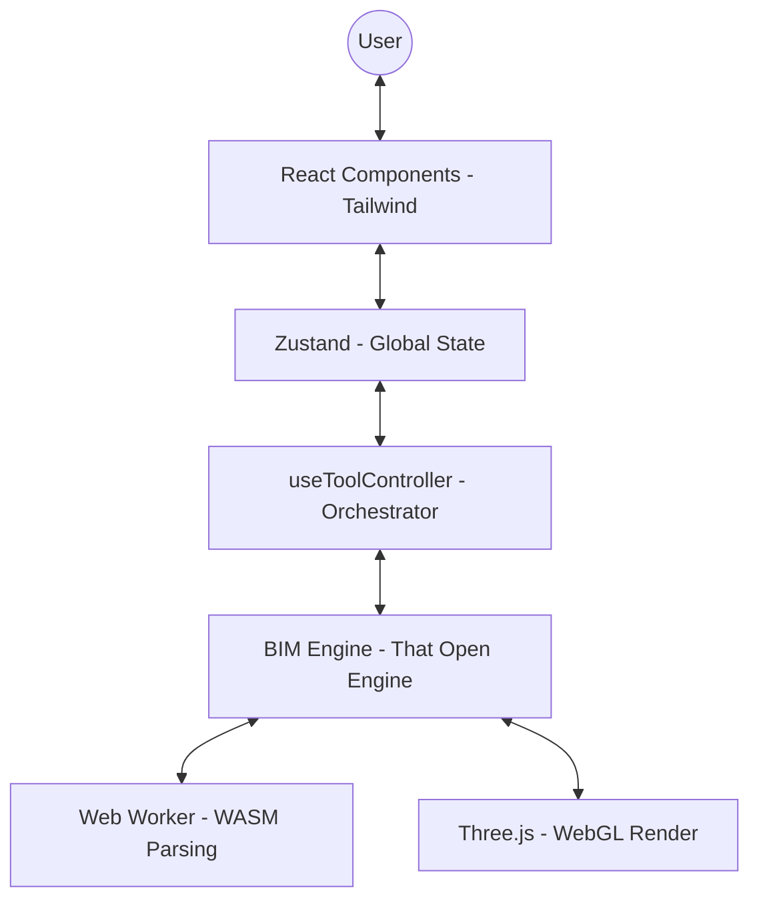

# 🚀 FUTURE_ME.md: BIM-WebGIS 3D Viewer Project

> **Chào bạn của tương lai!** Tài liệu này được thiết kế để giúp bạn nắm bắt toàn bộ bối cảnh, kiến trúc và các "bí mật" kỹ thuật của dự án này chỉ trong vài phút. Hãy đọc kỹ trước khi thực hiện bất kỳ thay đổi lớn nào.

---

## 1. Project Overview & Context
- **Mục tiêu:** Xây dựng nền tảng Web chuyên dụng để hiển thị, tương tác và phân tích mô hình BIM (IFC/Fragments) kết hợp dữ liệu GIS.
- **Vấn đề giải quyết:** Xử lý mô hình BIM cực lớn trên trình duyệt mà không làm treo UI (kiến trúc Fragments), đồng bộ hóa thuộc tính kỹ thuật giữa 3D và cấu trúc cây phân cấp (Spatial Tree).

### 📖 Glossary (Từ điển thuật ngữ)
| Thuật ngữ | Định nghĩa |
| :--- | :--- |
| **OBC / That Open** | Hệ sinh thái engine BIM mã nguồn mở kế thừa từ IFC.js. |
| **Fragment** | Định dạng nén hình học tối ưu cho Web (chuyển đổi từ IFC), sử dụng InstancedMesh để tăng hiệu năng. |
| **ExpressID** | ID duy nhất của một cấu kiện trong tệp IFC gốc. |
| **World** | Một "vũ trụ" trong Engine bao gồm Scene, Camera, và Renderer riêng biệt. |
| **Spatial Tree** | Cấu trúc cây phân cấp của tòa nhà (Project -> Site -> Building -> Storey -> Element). |

---

## 2. Architecture & Tech Stack

### 🏗 High-level Architecture


### 🛠 Tech Stack Rationale (ADR)
- **React + TypeScript:** Đảm bảo type-safety cho dữ liệu BIM phức tạp.
- **That Open Engine (OBC):** Chọn vì tính module hóa cao. Cho phép load từng phần mô hình và quản lý bộ nhớ tốt.
- **Zustand:** Quản lý state nhẹ và hiệu quả, phù hợp cho ứng dụng cần update liên tục (như đo lường, lựa chọn).
- **Vanilla CSS + Tailwind:** Tối ưu hiệu năng render UI đè lên Canvas 3D.

---

## 3. Core Logic & Data Flow

### 🌊 Luồng nạp Model & Khởi tạo (Critical)
1. **Fetch:** Tải tệp `.frag` từ Server.
2. **Parsing:** Đẩy vào Web Worker (WASM) thông qua `fragments.core.load`.
3. **Mounting:** 
    - Thêm `FragmentGroup` vào Scene.
    - **Quan trọng:** Lặp qua children của model để đăng ký meshes vào `world.meshes` (để Raycaster/Picking hoạt động ổn định).
4. **Analysis:** Chạy `generateSpatialTree` để map ID hình học với dữ liệu thuộc tính BIM.

---

## 4. Codebase Structure

```text
src/
├── components/
│   ├── engine/       # Logic tương tác trực tiếp với OBC Engine (Clipper, Measure, Highlighter)
│   ├── ui/           # React Components thuần (Toolbar, Panels, Dialogs)
│   └── BIMViewer.tsx # View chính, nơi kết nối Engine và React Lifecycle
├── context/
│   ├── bim/          # BIMProvider: Khởi tạo và quản lý vòng đời (lifecycle) của Engine
│   └── theme/        # Quản lý giao diện Light/Dark đồng bộ với Engine background
├── hooks/
│   └── engine/       # useToolController: Điều phối tool active và xử lý cleanup tự động
├── store/            # Zustand Slices: Quản lý Unit, Precision, Visibility, Selection
└── utils/            # Thuật toán phụ trợ: Parse Spatial Tree, Metadata handling
```

---

## 5. Key Algorithms & Design Patterns

### 🧩 Design Patterns & Best Practices
- **Dependency Injection (OBC Style):** Luôn lấy instance qua `components.get(Module)`.
- **Observer Pattern:** Sử dụng Engine events (vd: `onHighlight`) để đồng bộ trạng thái sang React Store.
- **Surgical Cleanup:** Luôn gỡ bỏ `Raycasters` và xóa meshes khỏi `world.meshes` trước khi dispose toàn bộ Engine để tránh lỗi Renderer.

### 5.3. Logic xử lý Cây không gian (Spatial Tree Generation)
Tệp `src/utils/generateSpatialTreeJSON.ts` chứa thuật toán quan trọng nhất để chuyển đổi dữ liệu BIM thô thành cấu trúc phân cấp thân thiện với UI.

**Các bước xử lý chính:**
1. **Lọc hình học (Geometry Filtering):** Sử dụng `model.getItemsWithGeometry()` để lấy danh sách `validIds`. Mục tiêu là loại bỏ các thực thể "vô hình" (như `IfcSpace`, `IfcOpeningElement`) để tránh làm nhiễu cây thư mục khi người dùng tương tác.
2. **Nhóm theo Tầng (Storey-based Roots):** Truy vấn tất cả các `IFCBUILDINGSTOREY`. Mỗi tầng sẽ đóng vai trò là một `rootId` trong cây.
3. **Phân loại ảo (Virtual Category Grouping):** Đây là logic tối ưu UI quan trọng. Thay vì render hàng nghìn phần tử trực tiếp dưới một tầng (gây lag DOM), code sẽ nhóm các phần tử cùng loại lại với nhau.
    - *Ví dụ:* `Storey 1` > `Wall (Group)` > `Wall Element A, B, C...`
    - Các nhóm này có ID ảo dạng `GROUP_{storeyId}_{categoryName}`.
4. **Cấu trúc Flat Map (Normalized State):** 
    - Toàn bộ cây được lưu trữ dưới dạng một Object phẳng (`Record<ID, ISpatialNode>`).
    - **Lợi ích:** Khi người dùng click vào một đối tượng 3D, chúng ta có thể truy xuất ngay lập tức thông tin Node trong Store mà không cần duyệt (traverse) qua cây thư mục phức tạp. Điều này cực kỳ quan trọng cho hiệu năng khi xử lý mô hình >10.000 cấu kiện.

---

## 6. Development & Operation

### 🛠 Local Setup
1. `pnpm install`
2. `pnpm dev`
3. Truy cập `localhost:5173`.

### 🌐 Environment & Assets
- **Worker:** Tệp `worker.mjs` nằm trong thư mục `public` là thành phần thiết yếu để nạp model Fragment.
- **WASM:** Các tệp `.wasm` cần được phục vụ đúng MIME type để Engine khởi tạo bộ giải mã.

---

## 7. Technical Debt & Future Roadmap

### ⚠️ Technical Debt (Cần xử lý)
- **Z-Fighting:** Cấu hình `polygonOffset` trong `BIMProvider` đang dùng factor ngẫu nhiên để xử lý tạm thời. Cần một hệ thống quản lý độ sâu lớp (depth layers) chặt chẽ hơn.
- **Volume Measurement:** Cần hỗ trợ xử lý các mô hình có hình học không đóng kín (Non-manifold geometry).

### 🗺 Roadmap
- [ ] Tích hợp MapLibre để hiển thị Model BIM chính xác trên tọa độ thực tế (WebGIS).
- [ ] BCF (BIM Collaboration Format): Lưu trữ và chia sẻ các vấn đề (issues) dưới dạng tọa độ 3D.
- [ ] Multi-model Support: Tải và hiển thị đồng thời nhiều mô hình với khả năng căn chỉnh vị trí.

---
*Tài liệu được khởi tạo vào 2026-04-01 bởi Senior Technical Architect.*
